# 経費申請システム（交通費・業務経費対応）

## 🌟 アプリ概要

このアプリは、社員が月ごとの交通費・業務経費をオンラインで申請できるシステムです。
申請内容は管理者画面から確認・承認ができ、領収書画像のアップロードもサポートしています。

## 🎯 開発の目的

- Excelや紙で行っていた経費申請を効率化したい
- 領収書の添付忘れや申請内容の入力漏れを防ぎたい
- Spring Boot + フロントエンドの技術で実践的なWebアプリを作りたかった

## 🔧 使用技術

| 項目         | 使用技術                       |
|--------------|--------------------------------|
| 言語         | Java (21), HTML/CSS/JavaScript |
| フレームワーク | Spring Boot, Thymeleaf          |
| DB           | SQLServer                          |
| その他       | Bootstrap, Maven, Eclipse       |

## 📸 画面イメージ

【申請者用画面】
- ログイン画面
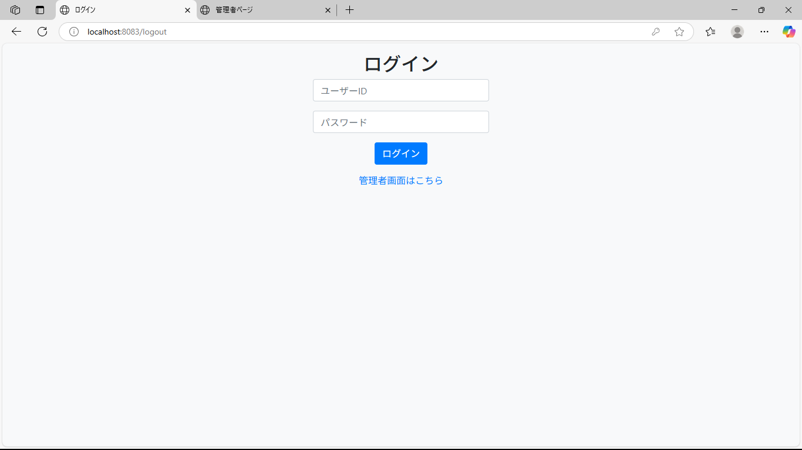

- 申請一覧（マイページ）  
初期画面には表示した年に申請した申請一覧が表示されます。
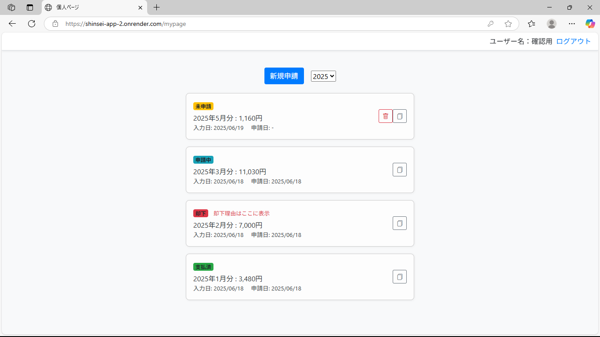

- 申請詳細画面
各業務経費の「追加」「コピー（チェックボックスを入れた内容をコピーしてモーダル画面表示）」ボタンで入力ができます。
チェックボックスで選択→「削除」ボタンで削除したい行の削除ができます。
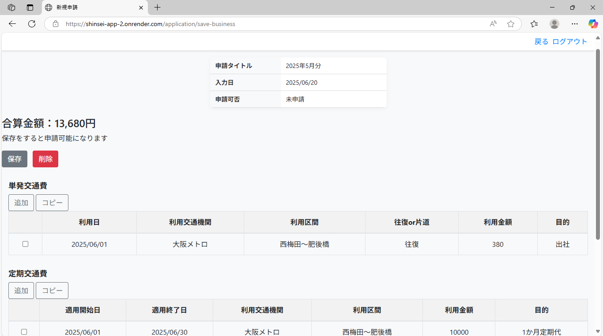
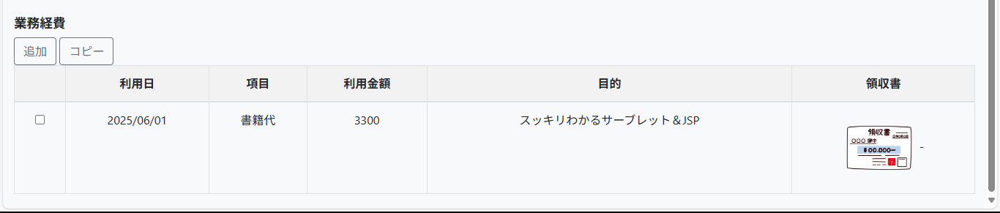

- 新規申請フォーム  
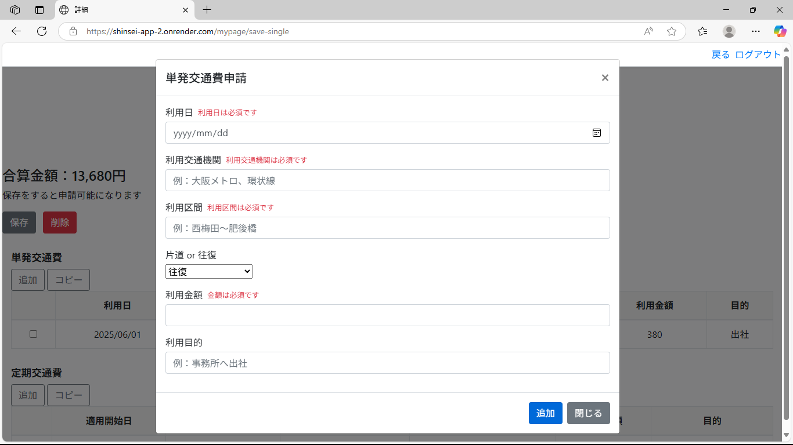

- 領収書画像アップロード機能
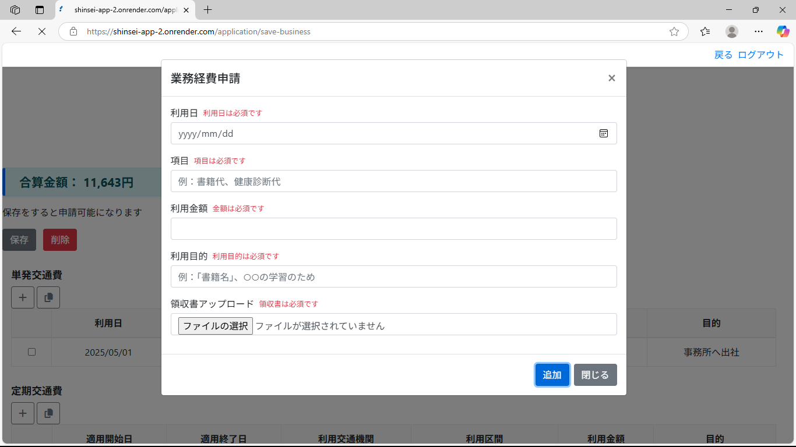

【管理者用画面】
- ログイン画面
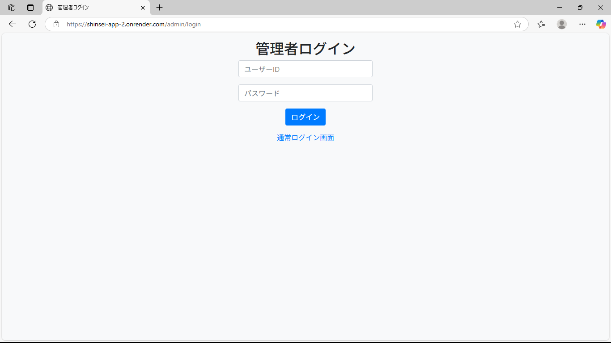

- 申請一覧（マイページ）
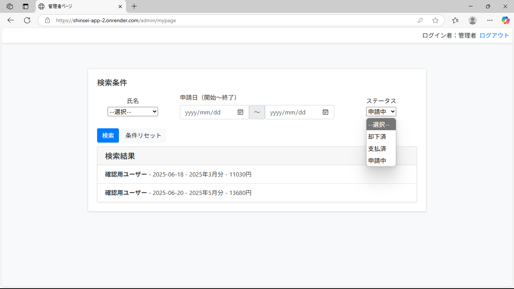

- 申請詳細画面

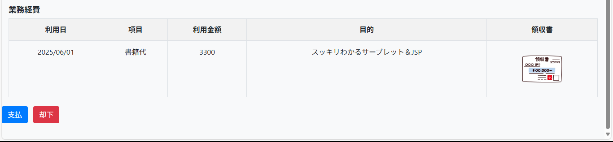

- 申請内容の承認・却下機能
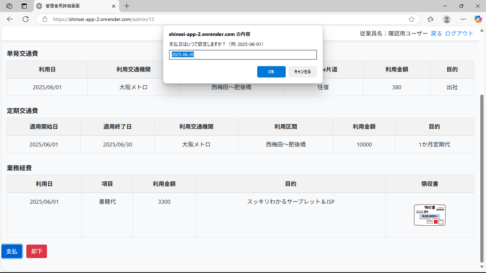
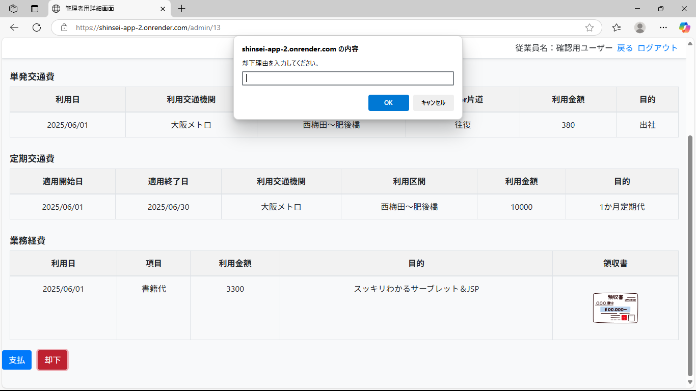

## 🔗 GitHubリポジトリ

https://github.com/ishikawa-dev/shinsei-app

## 🚀 公開URL（Render）

https://shinsei-app-2.onrender.com/login

ログインID：19970914 
パスワード：nnnn1111