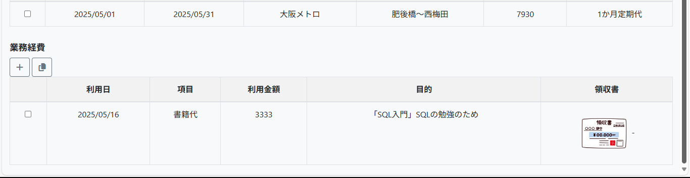
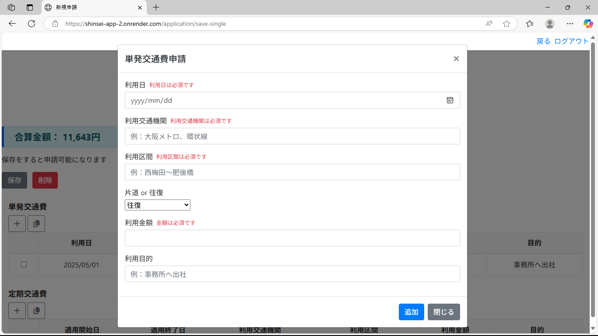
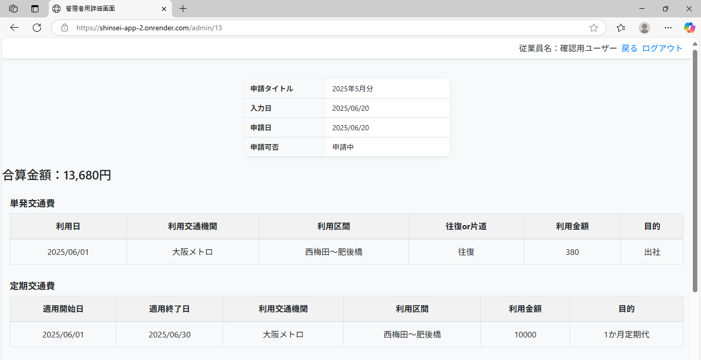

# 経費申請システム（交通費・業務経費対応）

## 🌟 アプリ概要

このアプリは、社員が月ごとの交通費・業務経費をオンラインで申請できるシステムです。
申請内容は管理者画面から確認・承認ができ、領収書画像のアップロードもサポートしています。
本アプリはレスポンシブ対応しており、スマートフォンからも快適に申請・操作できます。

## 🎯 開発の目的

- Excelや紙で行っていた経費申請を効率化したい
- 領収書の添付忘れや申請内容の入力漏れを防ぎたい
- Spring Boot + フロントエンドの技術で実践的なWebアプリを作りたかった

## 🔧 使用技術

| 項目         | 使用技術                       |
|--------------|--------------------------------|
| 言語         | Java (21), HTML/CSS/JavaScript |
| フレームワーク | Spring Boot, Thymeleaf          |
| DB           | SQLServer                          |
| その他       | Bootstrap, Maven, Eclipse       |

## 📸 画面イメージ

**【申請者用画面】**
- ログイン画面

- （スマホ表示）

- 申請一覧（マイページ）  

※初期画面には表示した年に申請した申請一覧が表示されます。

- （スマホ表示）

- 申請詳細画面 

※各業務経費の「追加」「コピー（チェックボックスを入れた内容をコピーしてモーダル画面表示）」ボタンで入力ができます。 
※チェックボックスで選択→「削除」ボタンで削除したい行の削除ができます。
※領収書の画像部分はクリックすると別タブで拡大表示されます。

- （スマホ表示）

- 新規申請フォーム  

※空欄のまま「追加」ボタンを押すとエラーメッセージが返ってきます

- （スマホ表示）

- 領収書画像アップロード機能

- （スマホ表示）

**【管理者用画面】**
- ログイン画面

- （スマホ表示）

- 申請一覧（マイページ）

※初期画面はステータス「申請中」の申請一覧が表示されます。

- （スマホ表示）

- 申請詳細画面

- （スマホ表示）

- 申請内容の承認・却下機能

※承認：支払日を入力すると承認が完了します。

- （スマホ表示）

※却下：却下理由を入力すると却下が完了します。

- （スマホ表示）

## 🔗 GitHubリポジトリ

https://github.com/ishikawa-dev/shinsei-app

## 🚀 公開URL（Render）

https://shinsei-app-2.onrender.com/login 
※無料枠使用のため初回読み込みに時間がかかることがあります

【通常ログイン（申請者用）】 
ログインID：19970914 
パスワード：nnnn1111 

【管理者用ログイン】 
ログインID：admin 
パスワード：admin 
